# ADAN-ADEC7900 Course Project: Group 4

## **_Group 4 Members:_** 

$\color{NavyBlue}{Yuhan\ Zhao}$

$\color{NavyBlue}{Jinglei\ Chen}$

$\color{NavyBlue}{Chenyi\ Wu}$

$\color{NavyBlue}{Yifei\ Li}$

## **Introduction** 
Liquor consumption patterns are influenced by a variety of socioeconomic and demographic factors, making it important to analyze these factors for effective public health and government policy development, and liquor businessmen. The purpose of this study is to analyze the socioeconomic and demographic determinants of liquor consumption in Iowa, with a focus on two research questions:
-  Is there a significant relationship between alcohol consumption and factors such as unemployment rate, income, and education levels, in Iowa cities?
-  How might alcohol consumption vary across racial groups in Iowa? Is there any unique link between certain racial groups with their alcohol consumption patterns under certain economic or educational conditions?

The results of the study will provide practical insights for public health agencies and governments. For public health agencies, the findings will help design targeted prevention and intervention plans to reduce alcohol-related health problems and societal costs. For government agencies, results will provide evidence-based support for alcohol tax, retail licensing, and urban planning policy development, ensuring that policies match the realities of Iowa's diverse communities.
We use R, Python for data analysis and Tableau for visualization. We believe that R and Python can support our data analysis by processing missing values, performing descriptive statistical analyses, and allowing for visualization of analysis results. And Tableau can help to build interactive dashboards and visual charts showing alcohol consumption patterns and their relationship to socio-economic factors by city. Also, we use Github to conduct team collaboration, data, results publishing and presentation.

## **Data Summary & Data Cleaning**
-  **Iowa Liquor Sales:** Collected by the Iowa Department of Revenue, this dataset includes alcohol sales data from January 1, 2012, categorized by product type, date of purchase, alcohol type, and store location.
-  **American Community Survey (ACS) Data:** Contains city-level data onunemployment rates, income levels, education levels, and racial demographics. Thesewill be used to examine alcohol consumption patterns in relation to socioeconomicfactors.

The dataset includes detailed sales information, such as average sales and sales volume for various liquor categories, as well as socioeconomic indicators such as income, education level, demographics, and unemployment. These features enable multidimensional analysis of alcohol sales patterns, and analysis can include both sales performance and potential demographic drivers of liquor consumption.

### Data Cleaning

Data cleaning began by loading sales data and merging it with ACS demographic and economic data at the county, city, and zip code levels. Then Missing values ​​were examined for each data and this issue was addressed by removing incomplete rows. Additional variables such and racial ratio (white to black) were added to the dataset to further enrich the analysis.

The raw data was then aggregated using a custom function. This function calculated total sales (`total.sale`) and total volume (`total.volume`) for each geographic level and used this to determine an average price (`price`), which is the ratio of total sales to total volume. This aggregation provided a overall view for subsequent analysis by removing detailed data for specific liquor categories. The resulting county, city, and zip code level datasets present simplified and aggregated liquor sales patterns while retaining key demographic and economic variables.

### Descriptive statistics analysis

#### Liquor category sales in coutry level

  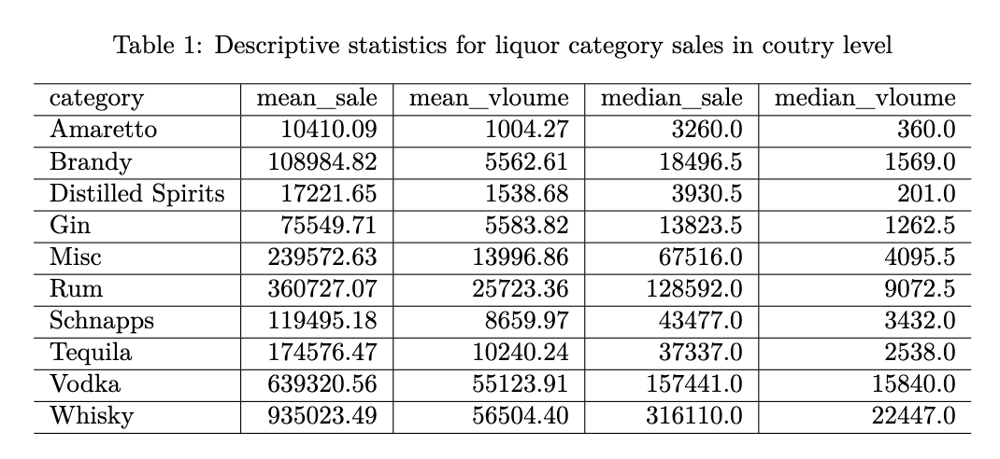

`Table 1` summarizes the liquor category sales at the county level, showing that **Whiskey had the highest average sales** ($935,023.49), followed by Vodka ($639,320.56) and Rum ($360,727.07). Categories such as Amaretto and Distilled Spirits have significantly lower average and median sales, indicating a smaller consumer base. The median is often lower than the mean for each category, and this implies outliers or counties with significantly higher sales. 

#### Liquor category sales in city level

  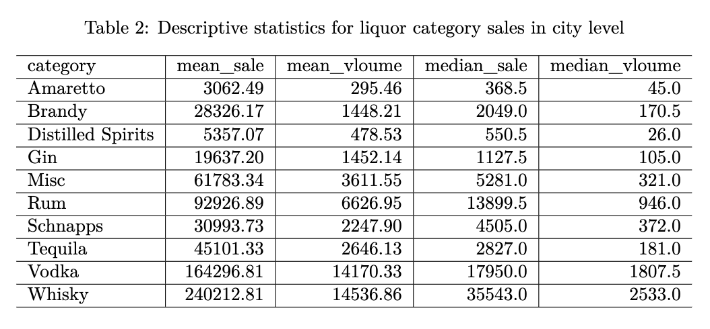

`Table 2` shows the results of the city-level analysis. Compared with the county-level data, the average and median sales of each category at this level are significantly lower, reflecting the impact of the narrowing of the analysis scope. Although whiskey and vodka are still the two categories with the highest sales, their sales at the city level are significantly lower than at the county level. Overall, Table 2 showed a more refined analysis analysis and provided a strong basis for in-depth exploration of alcohol consumption trends at the city level.

#### Liquor category sales in zipcode level

  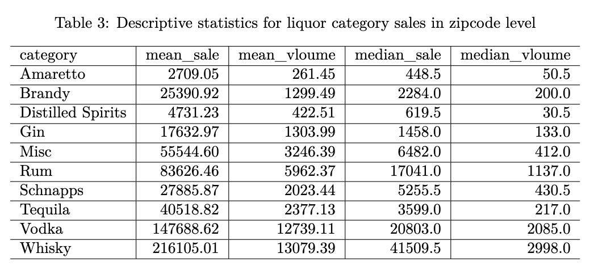

`Table 3` focuses on the data at the zip code level, which is the most detailed analysis perspective. At this level, the average and median sales of each category are lower than the city and county data. At the same time, the median sales of each category are significantly lower than the average, which also indicates that the distribution is right-skewed.

#### Aggregated sales in coutry level

  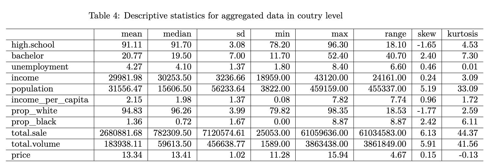

At the county level, an average percentage of 91.11% of the population has a high school education, and 20.77% have a bachelor's degree. Populations vary widely, with a large standard deviation (56,233.64). Total sales and total volume sold are highly skewed (skewness > 5), indicating that a few counties dominate alcohol sales. The price per unit of alcohol varies little (mean = $13.34, standard deviation = 1.02), indicating that pricing is consistent across counties.

#### Aggregated sales in city level

  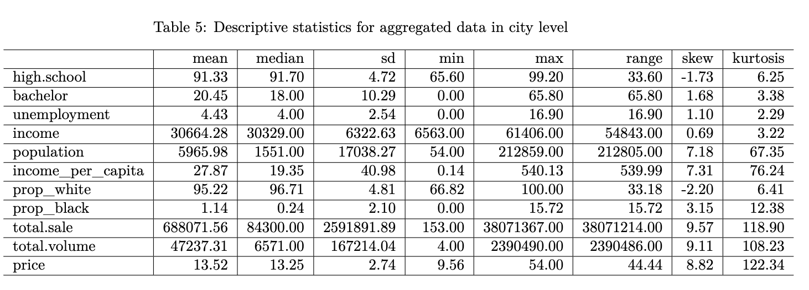

The distribution of economic and demographic characteristics at the city level is similar to that at the county level. However, due to the smaller geographical area, the sales volume and quantity of alcohol at the city level are significantly lower than those at the county level.

#### Aggregated sales in zipcode level

  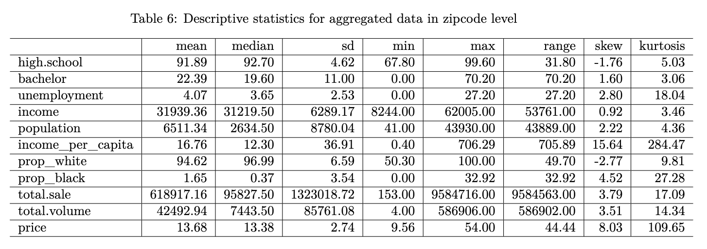

Similaryly, the distribution of economic and demographic characteristics at the zipcode level is also similar to that at the city level. And the sales volume and quantity of alcohol at the zipcode level are significantly lower than those at the city level.

## Data Analysis

### Initial Correlation Analysis for Aggregated Sales data at city level

  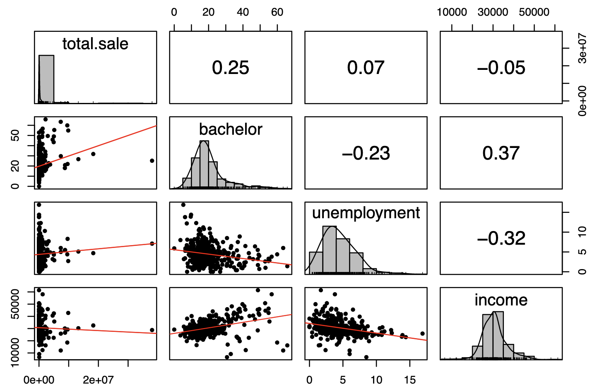

The correlation coefficient between alcohol consumption and education level (bachelor's degree) is 0.25, indicating a positive correlation. The scatter plot also suggested that as the proportion of people with higher education increases, alcohol consumption may increase, although the relationship is not strong. The correlation coefficient between alcohol consumption and unemployment is 0.07, showing a very weak positive correlation. Besides, scatter plot of alcohol consumption also suggested that unemployment has a positive effect on the level of alcohol consumption but it is very weak. The scatter plot between alcohol consumption and income indicates a very weak negative correlation (r = -0.05). This implied that income has almost no direct relationship with alcohol consumption, and as income increases, alcohol consumption has a slight downward trend. The distribution of alcohol consumption is severely right-skewed, while bachelor, unemployment, and income are slightly right-skewed

### Alcohol consumption and Factors in Iowa Cities
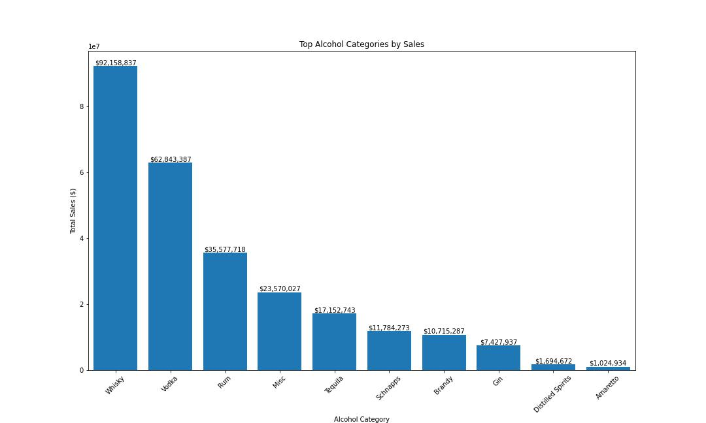

This figure shows the sales rankings for different alcohol categories in Iowa. Whiskey is the best-selling alcohol category with sales of over $92,158,837, indicating a significant preference for whiskey among Iowa residents. Comparatively, Gin, Distilled Spirit, and Amaretto had lower sales. This analytics data can guide liquor sellers in their stocking strategies. This data can be combined with the unit price of liquor to explore the impact of price factors on Iowa residents' choices of liquor, as well as to analyze incomes in different cities.

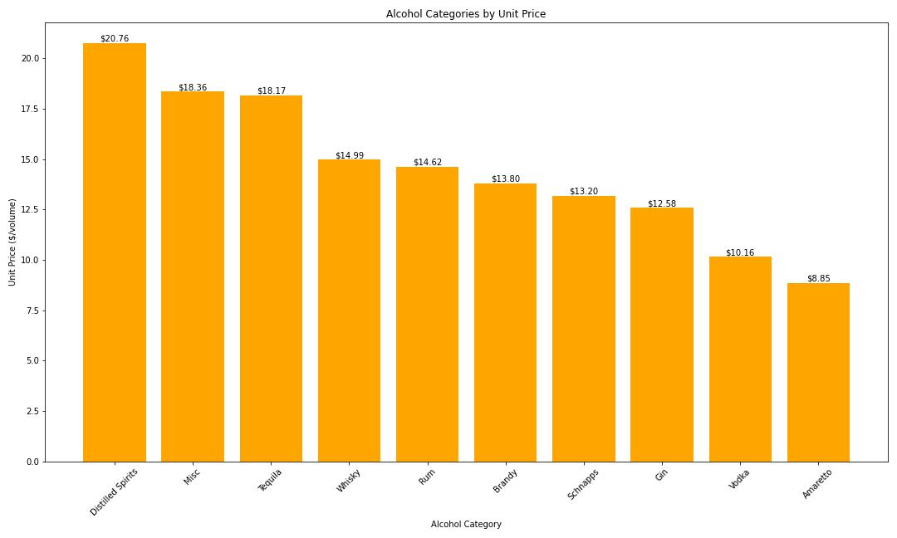

This figure shows the price ranking of alcohol categories per unit volume ($/liter); Distilled Spirits is the highest-priced category at $20.76 per unit volume, and Amaretto is the lowest-priced category at $8.85 per unit volume. Distilled Spirits, the most expensive wine, has the second lowest total sales, which could indicate that Iowa residents may not have a strong desire for alcohol, but Amaretto, the cheapest wine, has the lowest total sales, which could also indicate that Iowa residents may have a fair level of income and consumption, and wouldn't be able to save money by choosing the cheapest wine. The three highest sales are all in the $10-$15 per unit range, which can be considered the most acceptable range for alcohol prices among Iowa residents, a statistic that is helpful in guiding alcohol producers' pricing. The next analysis will analyze whether there is a relationship between consumers' educational income and the price of alcohol per unit by combining the city, income, and education. 

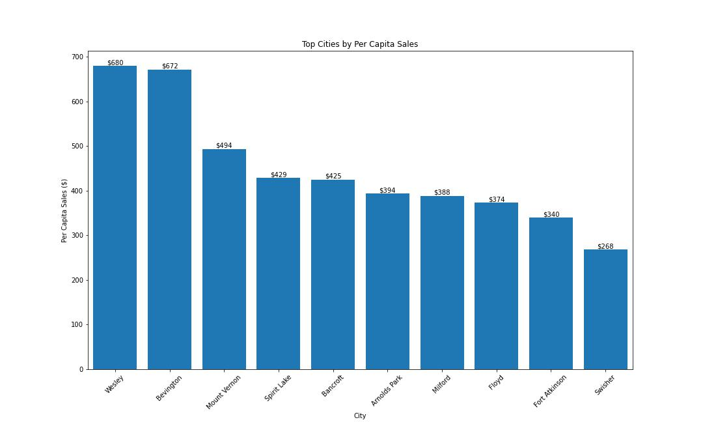

This figure shows the top 10 cities in Iowa by per capita alcohol consumption. Wesley and Bevington have significantly higher per capita alcohol consumption at $680 and $672, while Swisher has the lowest per capita consumption ( in the top 10 cities) at $268. Differences in per capita alcohol consumption between cities may be related to local economic conditions, the education level of residents, and socio-cultural attitudes toward alcohol consumption. This analytical data facilitates liquor sellers to determine the different inventories in each city. It also facilitates the government to determine the liquor tax in different cities.

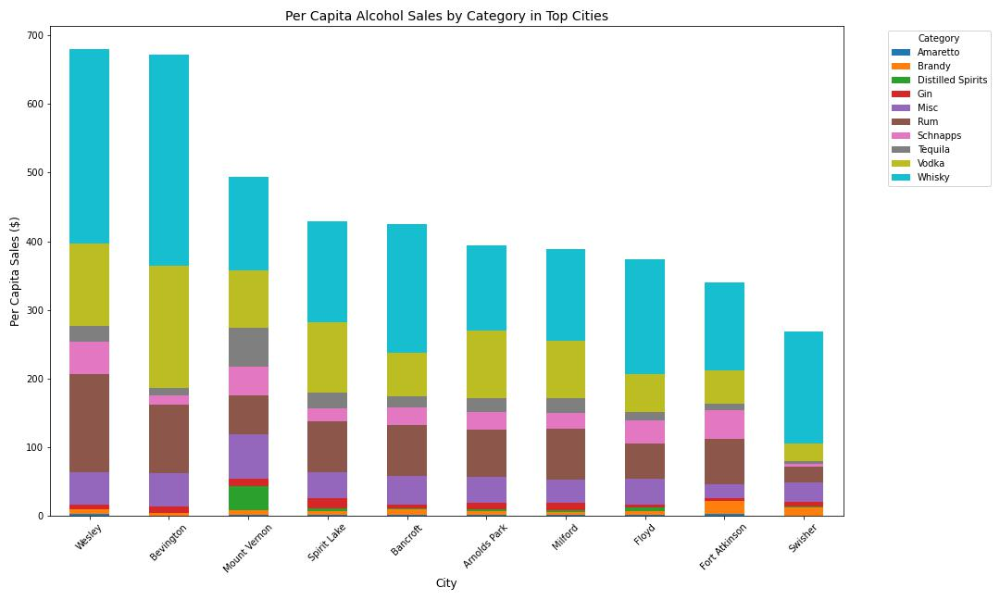
This figure shows the proportions of specific alcohol categories in the Top 10 cities for alcohol consumption per capita. Whiskey and vodka have the largest share in all cities. At $14.99 and $10.16 respectively, these two alcohols fall into the category of alcohol at and below the average unit price. This suggests that price may play an important role in these cities. Economic conditions may have influenced consumers' purchasing decisions, making them more inclined to choose wines that offer good value for money. However, in Mount Vernon, the most expensive wine, Distilled Spirits, can be clearly seen with a unit price of $20.76, and the second most expensive wine, Misc, also accounts for the largest proportion in the Top10, which suggests that this city may have a higher income level and consumption level. 

### Alcohol consumption and Race in Iowa Cities
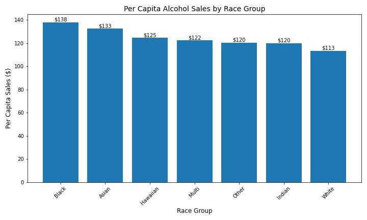

This figure shows the per capita consumption of alcohol among different races. It can be seen that Blacks and Asians are the highest per capita alcohol consumption groups, while Whites are the lowest per capita alcohol consumption group. This may have something to do with the racial percentage of each city, work environment, and stress, group habits, etc.

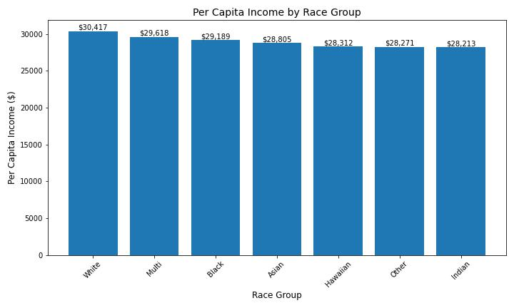

This figure shows a comparison of the per capita income of different racial groups in Iowa.The White group has the highest per capita income at $30,417.However, overall, there is not a great deal of difference in income between the races. Therefore, it can be assumed that alcohol consumption by race has little correlation with income.

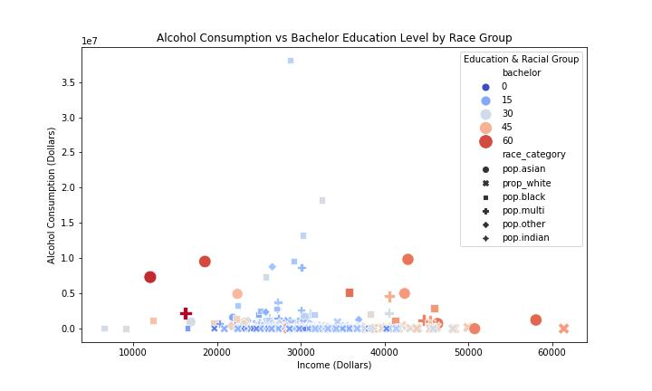

This figure shows the relationship between income, education level (percentage of bachelor's degree) and alcohol consumption for different racial groups. Overall, groups with higher incomes and higher levels of education (indicated by the red dots) are more likely to have higher alcohol consumption, but this trend is not absolute; there are small peaks in consumption among lower-income groups, mostly Asians and Blacks, which is consistent with the conclusions of the per capita consumption graph. 

## **Conclusion**

## **Policy Recommendation**

Iowa policymakers should consider introducing a graduated alcohol tax policy and targeted regulatory measures. This can better reflect the significant differences in per capita consumption, income levels, and education levels among different cities in the state. According to the analysis, Whiskey and Vodka—moderately priced and widely consumed—dominate in many communities. High-income, well-educated areas tend to purchase higher-priced categories, while low-income areas may be more sensitive to changes in alcohol prices. Based on the analysis, we recommend the following policy approaches：
  - Impose higher taxes on the most consumed alcohol categories
  - Use additional taxes from high-consumption areas to fund local education and public health campaigns
  - Carry out community alcohol education campaigns to increase people's awareness of the harms of excessive drinking

Implementing these policies has multiple positive influences. First, it can reduce excessive consumption and increase public awareness of the risks of drinking. At the same time, this can reduce alcohol-related medical and social costs in the long term, and promote market diversification and community equity. However, it is also necessary to pay attention to potential risks, including the financial burden on low-income families, the possible increase in illegal alcohol purchases, besides, this policy may also receive liquor industry resistance. Therefore, developing data-driven policies, combined with sensible tax adjustments and targeted public health interventions, could effectively improve alcohol consumption patterns in Iowa while balancing economic and social equity.

