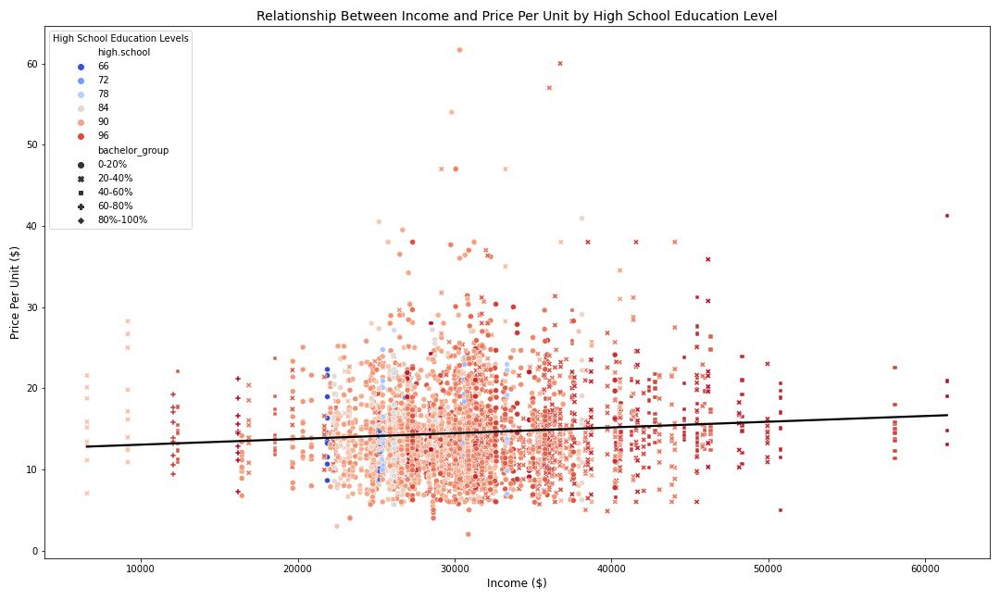
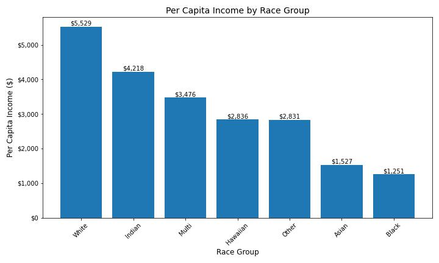

# ADAN-ADEC7900 Course Project: Group 4

## **_Group 4 Members:_** 

$\color{NavyBlue}{Yuhan\ Zhao}$

$\color{NavyBlue}{Jinglei\ Chen}$

$\color{NavyBlue}{Chenyi\ Wu}$

$\color{NavyBlue}{Yifei\ Li}$

## **Introduction** 
Liquor consumption patterns are influenced by a variety of socioeconomic and demographic factors, making it important to analyze these factors for effective public health and government policy development. The purpose of this study is to analyze the socioeconomic and demographic determinants of liquor consumption in Iowa, with a focus on two research questions:
-  Is there a significant relationship between alcohol consumption and factors such as unemployment rate, income, and education levels, in Iowa cities?
-  How might alcohol consumption vary across racial groups in Iowa? Is there any unique link between certain racial groups with their alcohol consumption patterns under certain economic or educational conditions?

The results of the study will provide practical insights for public health agencies and governments. For public health agencies, the findings will help design targeted prevention and intervention plans to reduce alcohol-related health problems and societal costs. For government agencies, results will provide evidence-based support for alcohol tax, retail licensing, and urban planning policy development, ensuring that policies match the realities of Iowa's diverse communities.
We use R, Python for data analysis and Tableau for visualization. We believe that R and Python can support our data analysis by processing missing values, performing descriptive statistical analyses, and allowing for visualization of analysis results. And Tableau can help to build interactive dashboards and visual charts showing alcohol consumption patterns and their relationship to socio-economic factors by county/city. Also, we use Github to conduct team collaboration, data, results publishing and presentation.

## **Data Summary**
-  **Iowa Liquor Sales:** Collected by the Iowa Department of Revenue, this dataset includes alcohol sales data from January 1, 2012, categorized by product type, date of purchase, alcohol type, and store location.
-  **American Community Survey (ACS) Data:** Contains city-level data onunemployment rates, income levels, education levels, and racial demographics. Thesewill be used to examine alcohol consumption patterns in relation to socioeconomicfactors.

## **Data Analytics**
### Alcohol consumption and Factors in Iowa Cities

This figure shows the sales rankings for different alcohol categories in Iowa. Whiskey is the best-selling alcohol category with sales of over $92,158,837, indicating a significant preference for whiskey among Iowa residents. Comparatively, Gin, Distilled Spirit, and Amaretto had lower sales. This analytics data can guide liquor sellers in their stocking strategies. This data can be combined with the unit price of liquor to explore the impact of price factors on Iowa residents' choices of liquor, as well as to analyze incomes in different cities.

This figure shows the price ranking of alcohol categories per unit volume ($/liter); Distilled Spirits is the highest-priced category at $20.76 per unit volume, and Amaretto is the lowest-priced category at $8.85 per unit volume. Distilled Spirits, the most expensive wine, has the second lowest total sales, which could indicate that Iowa residents may not have a strong desire for alcohol, but Amaretto, the cheapest wine, has the lowest total sales, which could also indicate that Iowa residents may have a fair level of income and consumption, and wouldn't be able to save money by choosing the cheapest wine. The three highest sales are all in the $10-$15 per unit range, which can be considered the most acceptable range for alcohol prices among Iowa residents, a statistic that is helpful in guiding alcohol producers' pricing. The next analysis will analyze whether there is a relationship between consumers' educational income and the price of alcohol per unit by combining the city, income, and education. 

This figure shows the top 10 cities in Iowa by per capita alcohol consumption. Wesley and Bevington have significantly higher per capita alcohol consumption at $680 and $672, while Swisher has the lowest per capita consumption ( in the top 10 cities) at $268. Differences in per capita alcohol consumption between cities may be related to local economic conditions, the education level of residents, and socio-cultural attitudes toward alcohol consumption. This analytical data facilitates liquor sellers to determine the different inventories in each city. It also facilitates the government to determine the liquor tax in different cities.

This figure shows the proportions of specific alcohol categories in the Top 10 cities for alcohol consumption per capita. Whiskey and vodka have the largest share in all cities. At $14.99 and $10.16 respectively, these two alcohols fall into the category of alcohol at and below the average unit price. This suggests that price may play an important role in these cities. Economic conditions may have influenced consumers' purchasing decisions, making them more inclined to choose wines that offer good value for money. However, in Mount Vernon, the most expensive wine, Distilled Spirits, can be clearly seen with a unit price of $20.76, and the second most expensive wine, Misc, also accounts for the largest proportion in the Top10, which suggests that this city may have a higher income level and consumption level. 

This figure shows the relationship between income, price per unit of alcohol, high school education level, and bachelor's degree. The graph shows that as income increases, the price per unit of alcohol consumed also increases slightly, suggesting that higher-income areas and populations may tend to purchase more expensive alcohol products. In addition, higher levels of high school education (in red) appear to be associated with higher incomes, suggesting that education level may influence income and alcohol consumption patterns to some extent. The different shapes of the markers indicate different proportions of bachelor's degrees, further suggesting that education level may have an impact on consumption choices. Overall, areas with higher incomes and higher levels of education tended to consume alcohol with a higher unit price, while areas with lower incomes and lower levels of education tended to choose alcohol with a lower price.

### Alcohol consumption and Race in Iowa Cities

This figure shows the per capita consumption of alcohol among different races. It can be seen that Blacks and Asians are the highest per capita alcohol consumption groups, while Whites are the lowest per capita alcohol consumption group. This may have something to do with the racial percentage of each city, work environment, and stress, group habits, etc.

This figure shows the per capita income among different races. It can be seen that whites have the highest per capita income at over $5,000. in contrast, blacks and Asians have the lowest at around $1,000. Combined with the per capita consumption of alcohol, it can be assumed that alcohol consumption is related to income, and a possible explanation is that low income and high stress in life lead to increased alcohol consumption. Based on the results of this analysis, policy decisions that can be made by the government may be to create more income opportunities for Blacks and Asians, provide them with psychological counseling, etc.

This figure shows the relationship between income, education level (percentage of bachelor's degree) and alcohol consumption for different racial groups. Overall, groups with higher incomes and higher levels of education (indicated by the red dots) are more likely to have higher alcohol consumption, but this trend is not absolute; there are small peaks in consumption among lower-income groups, mostly Asians and Blacks, which is consistent with the conclusions of the per capita consumption graph and the per capita income graph. The racial breakdown shows a wider distribution of consumption among Whites, while other races such as Blacks and Asians are concentrated in the low to middle range, perhaps due to income profiles. Overall, most consumption is concentrated in the lower range of income and consumption, which may reflect the positive impact of income and education levels on alcohol consumption.

## **Conclusion**

## **Policy Recommendation**

