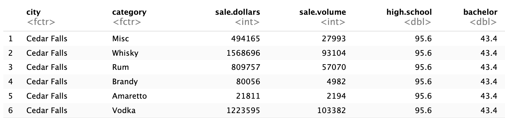
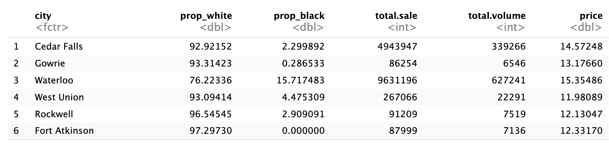
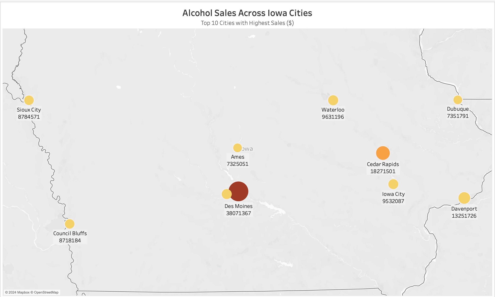
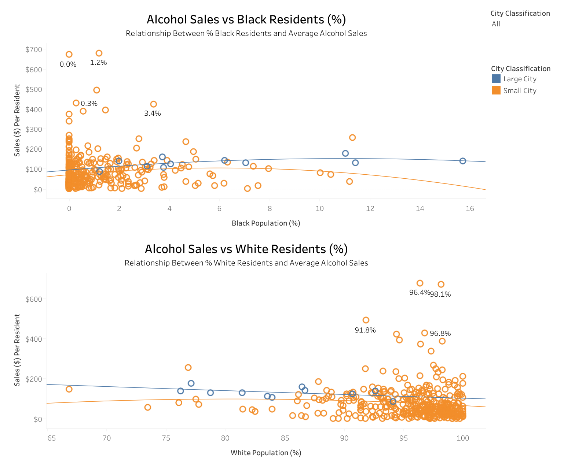
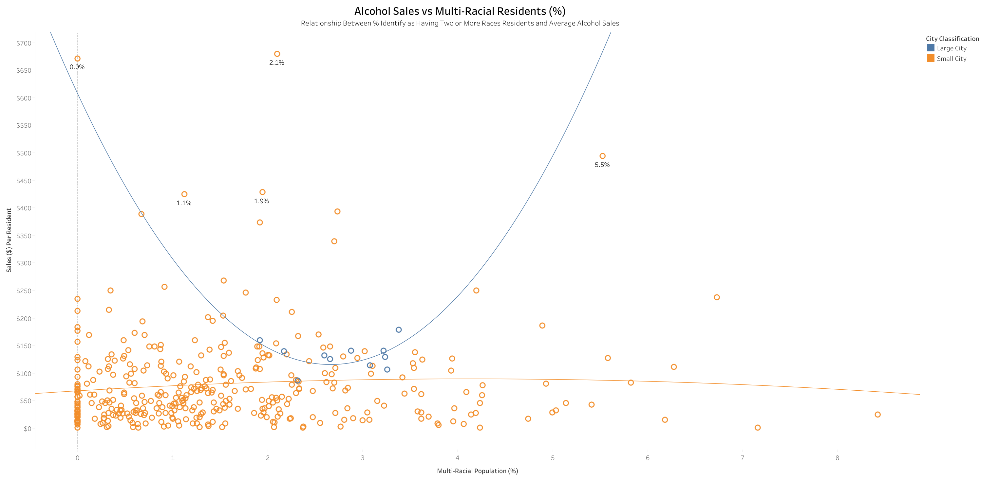
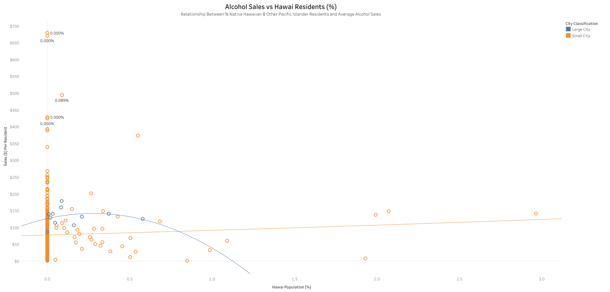
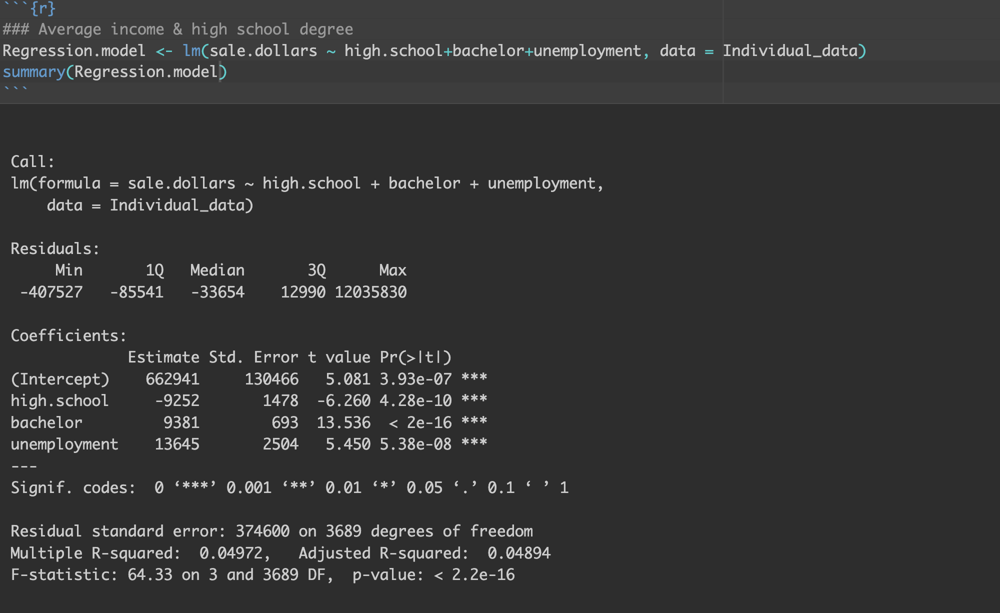

# ADAN-ADEC7900 Course Project: Group 4

## **_Group 4 Members:_** 

$\color{NavyBlue}{Yuhan\ Zhao}$

$\color{NavyBlue}{Jinglei\ Chen}$

$\color{NavyBlue}{Chenyi\ Wu}$

$\color{NavyBlue}{Yifei\ Li}$

## **Tableau Workbook** 
https://public.tableau.com/views/FinalAlcoholSalesvs_IncomeEducationRacialGroups/AlcoholSalesAcrossIowaCitiesbyLiquorCategories?:language=en-US&:sid=8E2B249C69A04EE3A78A866981F7B256-0:0&:redirect=auth&:display_count=n&:origin=viz_share_link

## **Introduction** 
Liquor consumption patterns are influenced by a variety of socioeconomic and demographic factors, making it important to analyze these factors for effective public health and government policy development, and liquor businessmen. The purpose of this study is to analyze the socioeconomic and demographic determinants of liquor consumption in Iowa, with a focus on two research questions:
-  Is there a significant relationship between alcohol consumption and factors such as unemployment rate, income, and education levels, in Iowa cities?
-  How might alcohol consumption vary across racial groups in Iowa? Is there any unique link between certain racial groups with their alcohol consumption patterns under certain economic or educational conditions?

The results of the study will provide practical insights for public health agencies and governments. For public health agencies, the findings will help design targeted prevention and intervention plans to reduce alcohol-related health problems and societal costs. For government agencies, results will provide evidence-based support for alcohol tax, retail licensing, and urban planning policy development, ensuring that policies match the realities of Iowa's diverse communities.
We use R, Python for data analysis and Tableau for visualization. We believe that R and Python can support our data analysis by processing missing values, performing descriptive statistical analyses, and allowing for visualization of analysis results. And Tableau can help to build interactive dashboards and visual charts showing alcohol consumption patterns and their relationship to socio-economic factors by city. Also, we use Github to conduct team collaboration, data, results publishing and presentation.

## **Data Summary & Data Cleaning**
-  **Iowa Liquor Sales:** Collected by the Iowa Department of Revenue, this dataset includes alcohol sales data from January 1, 2012, categorized by product type, date of purchase, alcohol type, and store location.
-  **American Community Survey (ACS) Data:** Contains city-level data onunemployment rates, income levels, education levels, and racial demographics. Thesewill be used to examine alcohol consumption patterns in relation to socioeconomicfactors.

The dataset includes detailed sales information, such as average sales and sales volume for various liquor categories, as well as socioeconomic indicators such as income, education level, demographics, and unemployment. These features enable multidimensional analysis of alcohol sales patterns, and analysis can include both sales performance and potential demographic drivers of liquor consumption.

### Data Cleaning

Data cleaning began by loading sales data and merging it with ACS demographic and economic data at the county, city, and zip code levels. Then Missing values ​​were examined for each data and this issue was addressed by removing incomplete rows. Additional variables such and racial ratio (white to black) were added to the dataset to further enrich the analysis.

The raw data was then aggregated using a custom function. This function calculated total sales (`total.sale`) and total volume (`total.volume`) for each geographic level and used this to determine an average price (`price`), which is the ratio of total sales to total volume. This aggregation provided a overall view for subsequent analysis by removing detailed data for specific liquor categories. The resulting county, city, and zip code level datasets present simplified and aggregated liquor sales patterns while retaining key demographic and economic variables.

- `data.clean` contains detailed information for each individual liquor category.
- `data.clean.2` aggregates total sales and volume across all liquor categories, providing summarized data for each city.
  Below are the sample of these two dataset.

  

  

### Descriptive statistics analysis

#### Liquor category sales in coutry level

  

`Table 1` summarizes the liquor category sales at the county level, showing that **Whiskey had the highest average sales** ($935,023.49), followed by Vodka ($639,320.56) and Rum ($360,727.07). Categories such as Amaretto and Distilled Spirits have significantly lower average and median sales, indicating a smaller consumer base. The median is often lower than the mean for each category, and this implies outliers or counties with significantly higher sales. 

#### Liquor category sales in city level

  

`Table 2` shows the results of the city-level analysis. Compared with the county-level data, the average and median sales of each category at this level are significantly lower, reflecting the impact of the narrowing of the analysis scope. Although whiskey and vodka are still the two categories with the highest sales, their sales at the city level are significantly lower than at the county level. Overall, Table 2 showed a more refined analysis analysis and provided a strong basis for in-depth exploration of alcohol consumption trends at the city level.

#### Liquor category sales in zipcode level

  

`Table 3` focuses on the data at the zip code level, which is the most detailed analysis perspective. At this level, the average and median sales of each category are lower than the city and county data. At the same time, the median sales of each category are significantly lower than the average, which also indicates that the distribution is right-skewed.

#### Aggregated sales in coutry level

  

At the county level, an average percentage of 91.11% of the population has a high school education, and 20.77% have a bachelor's degree. Populations vary widely, with a large standard deviation (56,233.64). Total sales and total volume sold are highly skewed (skewness > 5), indicating that a few counties dominate alcohol sales. The price per unit of alcohol varies little (mean = $13.34, standard deviation = 1.02), indicating that pricing is consistent across counties.

#### Aggregated sales in city level

  

The distribution of economic and demographic characteristics at the city level is similar to that at the county level. However, due to the smaller geographical area, the sales volume and quantity of alcohol at the city level are significantly lower than those at the county level.

#### Aggregated sales in zipcode level

  

Similaryly, the distribution of economic and demographic characteristics at the zipcode level is also similar to that at the city level. And the sales volume and quantity of alcohol at the zipcode level are significantly lower than those at the city level.

## Data Analysis

### Initial Correlation Analysis for Aggregated Sales data at city level

  

The correlation coefficient between alcohol consumption and education level (bachelor's degree) is 0.25, indicating a positive correlation. The scatter plot also suggested that as the proportion of people with higher education increases, alcohol consumption may increase, although the relationship is not strong. The correlation coefficient between alcohol consumption and unemployment is 0.07, showing a very weak positive correlation. Besides, scatter plot of alcohol consumption also suggested that unemployment has a positive effect on the level of alcohol consumption but it is very weak. The scatter plot between alcohol consumption and income indicates a very weak negative correlation (r = -0.05). This implied that income has almost no direct relationship with alcohol consumption, and as income increases, alcohol consumption has a slight downward trend. The distribution of alcohol consumption is severely right-skewed, while bachelor, unemployment, and income are slightly right-skewed

### Alcohol consumption and Factors in Iowa Cities

This figure shows the sales rankings for different alcohol categories in Iowa. Whiskey is the best-selling alcohol category with sales of over $92,158,837, indicating a significant preference for whiskey among Iowa residents. Comparatively, Gin, Distilled Spirit, and Amaretto had lower sales. This analytics data can guide liquor sellers in their stocking strategies. This data can be combined with the unit price of liquor to explore the impact of price factors on Iowa residents' choices of liquor, as well as to analyze incomes in different cities.

This figure shows the price ranking of alcohol categories per unit volume ($/liter); Distilled Spirits is the highest-priced category at $20.76 per unit volume, and Amaretto is the lowest-priced category at $8.85 per unit volume. Distilled Spirits, the most expensive wine, has the second lowest total sales, which could indicate that Iowa residents may not have a strong desire for alcohol, but Amaretto, the cheapest wine, has the lowest total sales, which could also indicate that Iowa residents may have a fair level of income and consumption, and wouldn't be able to save money by choosing the cheapest wine. The three highest sales are all in the $10-$15 per unit range, which can be considered the most acceptable range for alcohol prices among Iowa residents, a statistic that is helpful in guiding alcohol producers' pricing. The next analysis will analyze whether there is a relationship between consumers' educational income and the price of alcohol per unit by combining the city, income, and education. 

This figure shows the top 10 cities in Iowa by per capita alcohol consumption. Wesley and Bevington have significantly higher per capita alcohol consumption at $680 and $672, while Swisher has the lowest per capita consumption ( in the top 10 cities) at $268. Differences in per capita alcohol consumption between cities may be related to local economic conditions, the education level of residents, and socio-cultural attitudes toward alcohol consumption. This analytical data facilitates liquor sellers to determine the different inventories in each city. It also facilitates the government to determine the liquor tax in different cities.

This figure shows the proportions of specific alcohol categories in the Top 10 cities for alcohol consumption per capita. Whiskey and vodka have the largest share in all cities. At $14.99 and $10.16 respectively, these two alcohols fall into the category of alcohol at and below the average unit price. This suggests that price may play an important role in these cities. Economic conditions may have influenced consumers' purchasing decisions, making them more inclined to choose wines that offer good value for money. However, in Mount Vernon, the most expensive wine, Distilled Spirits, can be clearly seen with a unit price of $20.76, and the second most expensive wine, Misc, also accounts for the largest proportion in the Top10, which suggests that this city may have a higher income level and consumption level. 

### Alcohol consumption and Race in Iowa Cities

This figure shows the per capita consumption of alcohol among different races. It can be seen that Blacks and Asians are the highest per capita alcohol consumption groups, while Whites are the lowest per capita alcohol consumption group. This may have something to do with the racial percentage of each city, work environment, and stress, group habits, etc.

This figure shows a comparison of the per capita income of different racial groups in Iowa.The White group has the highest per capita income at $30,417.However, overall, there is not a great deal of difference in income between the races. Therefore, it can be assumed that alcohol consumption by race has little correlation with income. 

### Geographical Relationship Between Alcohol Consumption Across Iowa Cities

A map was created to explore potential geographical relationship with alcohol consumption across Iowa cities. We focused on how the total alcohol sales in dollars may vary across locations. For visualizing purposes, cities were marked and differentiated based on total sales, varying by sizes and colors of circles. A darker and larger size indicated a higher sales. Additionally, we filtered only top 10 cities with highest sales for a more focused comparison.

The map revealed a distinct geographical trends: cities in the Central-Southern (e.g., Des Moines) and Eastern Iowa (e.g., Cedar Rapids) have highest alcohol sales among Top 10 cities. This pattern implied a higher likelihood to consume alcohol in these cities and/or regions. Contrarily, cities located in Western Iowa (e.g., Sioux City) have relatively overall lower sales, implied a lower likelihood or level to consume alcohol.

One possible reasons behind such difference could be population density: cities in central areas are likely to have higher populations compared to other less densely populated cities, which contributed to a higher total alcohol sales for having greater amount of alcohol consumers. For example, Des Moines had over 20,0000 residents, which considered as moderate-large. Furthermore, urbanized cities may have higher density of bars, restaurants, and liquor stores, offering places to purchase alcohols. Finally, more job opening opportunities are in more urbanized cities often associated with higher incomes that enable residents to afford alcohol consumption. These combined reasons together explain differences in sales across Iowa.

###  Alcohol Consumption in Average Sales Across Racial Groups
We also looked into how alcohol consumption, measured by average sales, varies across racial groups in Iowa cities. To explore, we plotted sales per resident against the percentage of specific racial group within cities (obtained by sales in dollars/population, for each city). The dataset we used is `data.clean.2`, which aggregated total sales and volume across all liquor categories summarized for each city.

To gain a deeper insights of the dynamics, we further classified cities into either **“Large”** or **“Small”**, based on population size: Cities with a population >= 50,000 are considered as “Large.” The rationale for city classification see References. 
We added an interative filter to switch between "Large" vs "Small" cities. Polynimial trendlines describing the nature of relationship between two key interests were also added, providing a clear understanding of the relationship. Finally, the percentage of population of corresponding racial groups were highlighted if associated average sales were over $ 400, indicating a high alcohol consumption. We included comparasions of Sales Per Residents for White & Black Residents, Hawai Residents and Multi-Racial Group as examples below:

Overall, we found that average alcohol sales are high where lower % of each racial group reside, especially for small cities. This pattern was found in most racial groups, supported the observations that highlight points for average sales > $400 clusttered at the left side of the figures. Nevertheless, for White group, highest average sales occured where higher % of racial residents live. 

- **In Small cities**: there were slight or weak positive asscoiations between average sales and percentage of racial residents, implying that increase in one variable is associated with increase in another one. For some racial group (e.g., Black), we may observe a slight decline in sales with increase in %. Such difference inferred a cultural difference.
- **In Large cities**: Large cities were most likely to show a first incease and then declines in average sales with increase in % of residents, as described by trendlines. This excludes for those with two or more racial identities (i.e., Multi-racial group), where a reverse trend occurred: initially declines but then increases with higher % of residents (see the figures above)

It is important to note that the above conclusions are should be taked with careful considerations. For instance, there could be large variability in alcohol sales due to the small % of Hawaiian (<3%, indicated by x-axis)across cities. This small percentage of demographic in Iowa would bias interpretability. Detailed discussions on limitations see conclusion section.

Despite the above limitation, we can tell that city classification matters when investigating alcohol consumption dynamics by considering racial differences, though the associations were not be significantly strong since points scattered all around in the figures. The alcohol consumption trends were more uniform in small cities could be that a less densed cities share common alcohol drinking habbits, having limited recreational options compared to large cities. Diversities in racial groups and a wider range of choice and access of leisure in large or urbainized cities may associate with more complex preference in alcohol consumptions, explaining an initial increase and then decline in average sales, or more complicated trend of changes.  

Additionally, since the pattern vary across racial groups, it implies that cultural norms could significantly influence individuals' attitudes and behaviors toward alcohol consumption. Studies by Shih et al.(2023) on cultural values (e.g., familism, parental respect) on initial alcohol use offerred some insights: They supported the role of cultural values in the decision to use alcohol. In our case, cultural values could be impactful on cultivating mindeset how much and when individual would like drink, reflected by dynamics in sales per residents. For cities where residents have a blend of cultural norms (e.g., Multi-racial group), their alcohol consumption pattern vary more significantly, reflecting a complexities of mixed cultural backgrounds.

Refer back to earlier conclusions that Black and Asian residents demonstrated higher sales per capita than White residents than White residents, whereas here it showed higher % White residents is associated with higher alcohol consumptions. A variation in findings remind us to be mindful of other factors, such as socialeconomic (e.g., working oppirtunities) and psychological factors (e.g., community culturals), they can altogether contribute to variations in people's alcohol consumption choices.

###  Alcohol Consumption in Average Sales, in Dollars and Liters, vs. Income, Education Levels
Next, we investigated whether there are unique associations between alcohol consumption with two key economic and educational indicators: **median income** and **educational attainment**(high school or higher vs. bachelor or higher). Our analysis utilized `data.clean` which provided detailed information for alcohol sales for each individual liquor category for corresponding cities in Iowa. 

We created three figures respectively, each one used liquor categories as filters; we also highlighted the name of the liquor category where its ****average sales ($)** exceed $ 150** and ****average sales (in liters)** greater than 12 L**. Liquor categories were differentiated by colors and shapes, using an interative filter to switch between categories. Trendlines were added for each category to see overall change across incomes. See below for the result figures:

Sales_vs_Income.png)
We can see that most data points cluster around income roughly ranges from $20 to $ 40K, fall within a Lower to Middle-level income range. The highest average sales also associated middle level income, suggesting that these people were have highest likelihood to purchase for alcohols. However, alcohol consumption in dollars may not strongly or consistent associated with income in Iowa cities, due to a broad scattering of the points. This suggested that using income only may not do well in predicting alcohol consumption indicated by average sales.

Volume_Sale_vs_Income.png)
Similarly, the Lower-Middle income levels (~ $30K) dominate in terms of highest average volume sales, despite that there lacks of strong or consistent associations. Again, middle-income individuals are the primary consumers, exhibited a higher likelihood to drink alcohol. This makes sense as that a higher average sales is associated with greater volume of sales. For those who earn lower or higher income, volume sales do not significantly differ, suggesting lack of consumption patterns. 

Sales_vs_Education.png)
Generally, cities had a higher percentage of population who completed high school or higher degrees. Cities with higher percentages of bachelor's or higher degrees tend to have moderate alcohol consumption. There was a slight decrease and then increase in sales in cities with a higher percentage of residents attained bachelor degrees. Those who attained High school degree show little variation: alcohol consumption was higher in cities with a higher percentage of people attained this education level. 

However, both education levels did not do well in predicting alcohol consumption patterns because of the scattered data points, and did not vary significantly in terms of average sales between the two educational levels. This lack of understanding again suggested a consideration of including other possible explanatory factors, such as risk education on alcohol consumption, cultural factors, employment rate, to fully understand such complex patterns. We may also need a larger sample size (e.g., outside of Iowa) to be confident in observing difference in alcohol consumptions within each group. One study by Rosoff et al.(2021) provided some initial insights: their study based on ~780,000 participants concluded that educational attainment had important impact on alcohol consumption patterns & explain further health outcomes. Thus, additional relevant variables (e.g., resident features) would be helpful for gaining deeper insights in our research interest.

### Regression Predicting Total Sales ($) Based on Education Levels and Unemployment Rate
Furthermore, we performed a regression analysis to gain further insights how educational and socioecnomic factors contribute to individuals' alcohol consumption behaviors, measured in dollars. To investigate, we utilized `data.clean`, which contains detailed information of alcohol sales for each individual liquor category across cities. Our predictor variables are bachelor, high school degree attainment rates and unemployment rates. These are three major educational and socioeconomic factors we believe contribute to understanding of alcohol consumption behaviors. The outcome variable was sales for each type of liquor within each city. See below for our regression results:

The results revealed a statistically significant associations between all three predictors and the outcome variable, indicated by _p-value_ less than .001 level. Attaining a bachelor or higher degree seemed to have particularly significant associations with alcohol sales, indicated by an extremely small _p-value_. The estmitates for each three predictors can be interpreted as following: for every 1% increase in high school graduates, bachelor graduates, and unemployment rates, there will be a decrease of $ 9252, an increase of $ 9381, and increase of $ 13645 in alcohol sales. The positive relationship with employment and alcohol sales was superisely contrary to intution. However, an adjusted R-squared value of 0.048 suggested that only about 4.8% of the variability in sales can be explained by the predictors in this model. Therefore, adding more preditor variables are critical for improve the model, and may reveal the full story in terms of relationship among variables.  

### Correlation of Alcohol Consumption with Unemployment and Education Levels

This correlation heatmap highlights the relationship between alcohol consumption and various socioeconomic factors. For alcohol consumption and education, there is a weak negative correlation with high school attainment (-0.01) and a weak positive correlation with bachelor’s degree attainment (0.18). These findings suggest that higher education levels might be slightly associated with increased alcohol spending. Regarding unemployment, there is a weak positive correlation with alcohol consumption (0.05), indicating that unemployment may not have a strong direct relationship with alcohol consumption. Unemployment also negatively correlates with bachelor’s degree attainment (-0.22) and high school attainment (-0.14), implying that higher unemployment rates are associated with lower education levels. Lastly, high school attainment and bachelor’s degree attainment show a moderate positive correlation (0.47), which aligns with the expectation that higher educational achievements often build upon prior educational milestones.

### Alcohol Consumption and Racial/Economic Factors

This heatmap illustrates the relationship between alcohol consumption and racial/economic factors. To analyze population proportions by race, we calculated each race's proportion within a city by dividing the racial population count by the total population of that city. Alcohol consumption shows a moderate positive correlation with the proportion of Black populations (0.35) and Asian populations (0.24), as well as weak positive correlations with Native Hawaiian/Other Pacific Islander populations (0.03) and American Indian/Alaska Native populations (0.02). Conversely, there is a moderate negative correlation with the proportion of White populations (-0.31), suggesting that areas with higher alcohol consumption may spend relatively less in predominantly White communities. Interracial population correlations reveal strong negative relationships between the proportions of White and Black populations (-0.72) and White and Asian populations (-0.73), indicating demographic exclusivity in certain regions. Correlations between unemployment and racial proportions are very weak (ranging from -0.11 to 0.13), suggesting minimal direct racial disparity in unemployment rates across these groups within the dataset.

Overall, alcohol spending appears more closely correlated with racial composition than with education or unemployment. The interplay between racial group proportions highlights demographic trends and clustering patterns across Iowa cities.

### Clusters of Cities Based on Alcohol Consumption and Socioeconomic Factors

This clustering plot highlights a positive correlation between income and alcohol consumption across cities, using the KMeans clustering algorithm to group cities based on similarities in selected variables such as income, alcohol expenditure, and unemployment. The clustering process employs StandardScaler to normalize the data, ensuring equal contribution from all features, and utilizes Euclidean distance to assign cities to clusters in the scaled feature space.
The analysis categorizes cities into three clusters based on their income and alcohol consumption patterns:

- Cluster 0 (Low Income, Low Consumption): Cities with lower income levels and minimal alcohol consumption.
- Cluster 1 (Moderate Income, High Consumption): Cities with moderate incomes and higher alcohol consumption.
- Cluster 2 (High Income, Moderate Consumption): Cities with relatively higher incomes but moderate alcohol consumption.

The relationship between income and alcohol consumption reveals a positive trend, with both factors increasing as we progress from Cluster 0 to Cluster 2. Higher income levels may enable greater alcohol expenditure, although cultural, social, and regional factors likely also play a role.
Clusters are labeled based on income distribution:
- Low Income: Below one standard deviation from the mean or the 33rd percentile.
- Moderate Income: Within one standard deviation of the mean or between the 33rd and 66th percentiles.
- High Income: Above one standard deviation from the mean or the 66th percentile.

Higher income may facilitate increased alcohol consumption, but this is not definitive without further investigation. Cultural and Social also have impactes, variations in cultural norms, social attitudes, and alcohol availability could also impact consumption patterns. While the plot shows correlation, it does not establish causation. Other factors might influence both income and alcohol consumption.

## **Conclusion**

The explorations come with several limitations: First, the raw dataset provided by ACS "only contained estimates of the characteristics of the population, not to provide counts of the population in different geographic areas or population subgroups;" additionally, the estimates did not include estimate data by race for American Indian and Alaska Native areas (U.S. Census Bureau, n.d). As such, the representativeness of dataset may be concerned with have a full coverage of racial groups in Iowa. Using estimation of characteristics could be biased by many factors, such as data collection methods, context, time-point. Furthremore, the validity (i.e., to what extent our exploration, measurement, analysis results correctly answered our research question) of our analysis might be questioned due to the same reason of data nature. 

Second, the small proportion for some racial groups (e.g., % Hawai) within cities may result in a high heterogenity of data, be less reprentative for those groups, and bring in a large variability in alcohol sales. This would challenge us to conclude a consistent trend in alcohol consumption behaviors for those racial groups. This low proportion of collected data could be due to sampling restrictions (e.g., lack of access to residents identified from those racial groups). Future studies on alcohol consumptions could work on expanding the range of data collections, for example inclusion of more states in U.S, to have a more comprehensive idea of attitudes and habits of drinking for residents identified as from racial groups. It would also be important for increase a generalizability of the findings, to drawing a wider, cross-states conclusions. 

Lastly, additional variables should be included in future regression models. 

## **Policy Recommendation**

Iowa policymakers should consider introducing a graduated alcohol tax policy and targeted regulatory measures. This can better reflect the significant differences in per capita consumption, income levels, and education levels among different cities in the state. According to the analysis, Whiskey and Vodka—moderately priced and widely consumed—dominate in many communities. High-income, well-educated areas tend to purchase higher-priced categories, while low-income areas may be more sensitive to changes in alcohol prices. Based on the analysis, we recommend the following policy approaches：
  - Impose higher taxes on the most consumed alcohol categories
  - Use additional taxes from high-consumption areas to fund local education and public health campaigns
  - Carry out community alcohol education campaigns to increase people's awareness of the harms of excessive drinking

Implementing these policies has multiple positive influences. First, it can reduce excessive consumption and increase public awareness of the risks of drinking. At the same time, this can reduce alcohol-related medical and social costs in the long term, and promote market diversification and community equity. However, it is also necessary to pay attention to potential risks, including the financial burden on low-income families, the possible increase in illegal alcohol purchases, besides, this policy may also receive liquor industry resistance. Therefore, developing data-driven policies, combined with sensible tax adjustments and targeted public health interventions, could effectively improve alcohol consumption patterns in Iowa while balancing economic and social equity.

## **References**
**Rationale for classifying Large Cities:**
https://en.wikipedia.org/wiki/Iowa_statistical_areas#:~:text=The%20OMB%20defines%20a%20core,with%2010%2C000%20to%2049%2C999%20people.

**Disussion on Cultural Norms and Alcohol Use:**
Shih, R. A., Miles, J. N. V., Tucker, J. S., Zhou, A. J., & D'Amico, E. J. (2012). Racial/ethnic differences in the influence of cultural values, alcohol resistance self-efficacy, and alcohol expectancies on risk for alcohol initiation. Psychology of Addictive Behaviors, 26(3), 460–470. https://doi.org/10.1037/a0029254

**Disussion on Alcohol Consumption and Education Attainment:**
Rosoff, D. B., Clarke, T. K., Adams, M. J., McIntosh, A. M., Davey Smith, G., Jung, J., & Lohoff, F. W. (2021). Educational attainment impacts drinking behaviors and risk for alcohol dependence: results from a two-sample Mendelian randomization study with ~780,000 participants. Molecular psychiatry, 26(4), 1119–1132. https://doi.org/10.1038/s41380-019-0535-9

**Limitations on ACS data:**
https://www.census.gov/content/dam/Census/library/publications/2021/acs/acs_aian_handbook_2021_ch01.pdf
